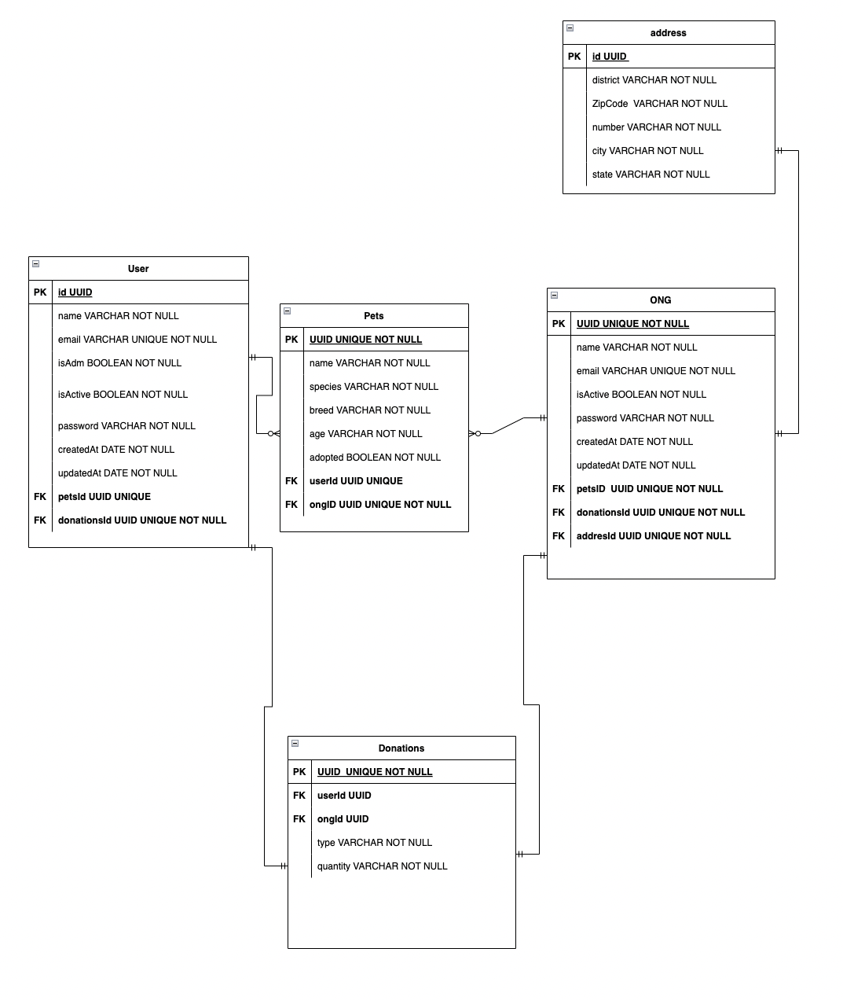

# Documentação da API

**BASE_URL: https://keropets.herokuapp.com/**

## Tabela de Conteúdos

- [Visão Geral](#1-visão-geral)
- [Diagrama ER](#2-diagrama-er)
- [Início Rápido](#3-início-rápido)
    - [Instalando Dependências](#31-instalando-dependências)
    - [Variáveis de Ambiente](#32-variáveis-de-ambiente)
    - [Migrations](#33-migrations)
- [Autenticação](#4-autenticação)
- [Endpoints](#5-endpoints)

---

## 1. Visão Geral

Visão geral do projeto, um pouco das tecnologias usadas.

- [NodeJS](https://nodejs.org/en/)
- [Express](https://expressjs.com/pt-br/)
- [TypeScript](https://www.typescriptlang.org/)
- [PostgreSQL](https://www.postgresql.org/)
- [TypeORM](https://typeorm.io/)

---

## 2. Diagrama ER
[ Voltar para o topo ](#tabela-de-conteúdos)


Diagrama da API definindo bem as relações entre as tabelas do banco de dados.



---

## 3. Início Rápido
[ Voltar para o topo ](#tabela-de-conteúdos)


### 3.1. Instalando Dependências

Clone o projeto em sua máquina e instale as dependências com o comando:

```shell
yarn
```

### 3.2. Variáveis de Ambiente

Em seguida, crie um arquivo **.env**, copiando o formato do arquivo **.env.example**:
```
cp .env.example .env
```

Configure suas variáveis de ambiente com suas credenciais do Postgres e uma nova database da sua escolha.

### 3.3. Migrations

Execute as migrations com o comando:

```
yarn typeorm migration:run -d src/data-source.ts
```

---

## 4. Endpoints

[ Voltar para o topo ](#tabela-de-conteúdos)

### Índice

- [User](#1-user)
    - [POST - /user](#11-criação-de-usuário)
    - [POST - /user/login](#12-login-de-usuário)
    - [GET - /user](#13-listando-usuários)
	- [PATCH - /user/:id](#14-update-usuário)
	- [DELETE - /user/:id](#15-delete-usuário)
- [Pets](#2-pets)
	- [POST - /pets](#21-criação-de-pet)
	- [GET - /pets](#22-listando-pets)
	- [PATCH - /pets/:id](#23-update-pet)
	- [PATCH - /pets/adopt/:id](#24-adote-pet)
	- [DELETE - /pets/:id](#25-delete-pet)
- [Donations](#3-donations)
	- [POST - /donations](#1-criação-de-doação)
- [Ong](#4-ong)
	- [POST - /ong](#41-criação-de-ong)
	- [POST - /ong/login](#42-login-da-ong)
	- [GET - /ong](#43-listando-ongs)
	- [GET - /ong/:id](#44-listando-ongs-por-id)
	- [PATCH - /ong/:id](#45-update-ong)
	- [DELETE - /ong/:id](#46-delete-ong)

---

## 1. **User**
[ Voltar para os Endpoints ](#5-endpoints)

### Endpoints

| Método   | Rota       | Descrição                               |
|----------|------------|-----------------------------------------|
| POST     | /user     | Criação de um usuário.                  |
| POST     | /user/login     | Login de um usuário.                  |
| GET      | /user     | Lista todos os usuários.                 |
| PATCH      | /user/:id     | Update do usuário. 
| DELETE      | /user/:id     | Delete de um usuário. 

---

### 1.1. **Criação de Usuário**

[ Voltar para os Endpoints ](#5-endpoints)

### `/user`

### Corpo da Requisição:
```json
{
	"name": "Fulano",
	"email": "fulano@mail.com",
	"password": "1234",
	"isAdm": true,
	"isActive": true
}
```

### 1.2. **Login usuário**

[ Voltar aos Endpoints ](#5-endpoints)

### `/user/login`

### Corpo da Requisição:
```json
{
	"email": "fulano@mail.com",
	"password": "1234",
}
```

### 1.3. **Listando Usuários**

[ Voltar aos Endpoints ](#5-endpoints)

### `/user`

### Exemplo de Request:
```
GET /user
```

### 1.4. **Update usuário**

[ Voltar aos Endpoints ](#5-endpoints)

### `/user/:id`

### Corpo da Requisição:
```json
{
	"name": "Novo nome",
	"email": "Novo email",
	"password": "Nova senha"
}
```

### 1.5. **Delete usuário**

[ Voltar aos Endpoints ](#5-endpoints)

### `/user/:id`

### Exemplo de Request:
```
DELETE /user/:id
```

## 2. **Pets**
[ Voltar para os Endpoints ](#5-endpoints)

### Endpoints

| Método   | Rota       | Descrição                               |
|----------|------------|-----------------------------------------|
| POST     | /pets     | Criação de um pet.                  |
| GET     | /pets     | Listando pets.                  |
| PATCH      | /pets/:id     | Update de um pet.                 |
| PATCH      | /pets/adopt/:id     | Adote um pet. 
| DELETE      | /pets/:id     | Delete de um pet. 

---

### 2.1. **Criação de Pet**

[ Voltar para os Endpoints ](#5-endpoints)

### `/pets`

### Corpo da Requisição:
```json
{
	"name": "Rex",
	"species": "Pitbull",
	"breed": "Maltês",
	"age": "1",
	"ownerId": "3"
}
```

### 2.2. **Listando Pets**

[ Voltar aos Endpoints ](#5-endpoints)

### `/pets`

### Exemplo de Request:
```
GET /pets
```

### 2.3. **Update pet**

[ Voltar aos Endpoints ](#5-endpoints)

### `/pets/:id`

### Corpo da Requisição:
```json
{
	"name": "Novo nome",
	"species": "Nova espécie",
	"breed": "Nova raça",
	"age": "Nova idade"
}
```

### 2.4. **Adote um pet**

[ Voltar aos Endpoints ](#5-endpoints)

### `/pets/adopt/:id`

### Corpo da Requisição:
```json
{
	"ownerId": "Id do dono",
}
```

### 2.5. **Delete pet**

[ Voltar aos Endpoints ](#5-endpoints)

### `/pets/:id`

### Exemplo de Request:
```
DELETE /pets/:id
```

## 3. **Donations**
[ Voltar para os Endpoints ](#5-endpoints)

### Endpoints

| Método   | Rota       | Descrição                               |
|----------|------------|-----------------------------------------|
| POST     | /donations     | Criação de uma doação.                  |
---

### 3.1. **Criação de uma doação**

[ Voltar para os Endpoints ](#5-endpoints)

### `/donations`

### Corpo da Requisição:
```json
{
	"donated": "50",
	"donatedBy": "Fulano",
	"donatedTo": "Pequenos Cachorros Adoção"
}
```

## 4. **Ong**
[ Voltar para os Endpoints ](#5-endpoints)

### Endpoints

| Método   | Rota       | Descrição                               |
|----------|------------|-----------------------------------------|
| POST     | /ong     | Criação de uma ong.                  |
| POST     | /ong/login     | Login de uma ong.                  |
| GET      | /ong     | Lista todas as ongs                 |
| GET      | /ong/:id     | Listar ong por id              |
| PATCH      | /ong/:id     | Update de uma ong. 
| DELETE      | /ong/:id     | Delete de uma ong. 
---

### 4.1. **Criação de uma ong**

[ Voltar para os Endpoints ](#5-endpoints)

### `/ong`

### Corpo da Requisição:
```json
{
	"name": "Pequenos Cachorros Adoção",
	"email": "pequenosdogs@mail.com",
	"password": "123456",
	"isOngAdm": true,
	"address": {
		"district": "Partenon",
    		"zipCode": "95000-000",
    		"number": "47",
    		"city": "Porto Alegre",
	    	"state": "RS"
	}
}
```

### 4.2. **Login ong**

[ Voltar aos Endpoints ](#5-endpoints)

### `/ong/login`

### Corpo da Requisição:
```json
{
	"email": "pequenosdogs@mail.com",
	"password": "123456",
}
```

### 4.3. **Listando Ongs**

[ Voltar aos Endpoints ](#5-endpoints)

### `/ong`

### Exemplo de Request:
```
GET /ong
```

### 4.4. **Listando Ong por Id**

[ Voltar aos Endpoints ](#5-endpoints)

### `/ong/:id`

### Exemplo de Request:
```
GET /ong/:id
```

### 4.5. **Update ong**

[ Voltar aos Endpoints ](#5-endpoints)

### `/ong/:id`

### Corpo da Requisição:
```json
{
	"name": "Novo nome da ong",
	"email": "Novo email",
	"password": "Nova senha"
}
```

### 4.5. **Delete ong**

[ Voltar aos Endpoints ](#5-endpoints)

### `/ong/:id`

### Exemplo de Request:
```
DELETE /ong/:id
```
